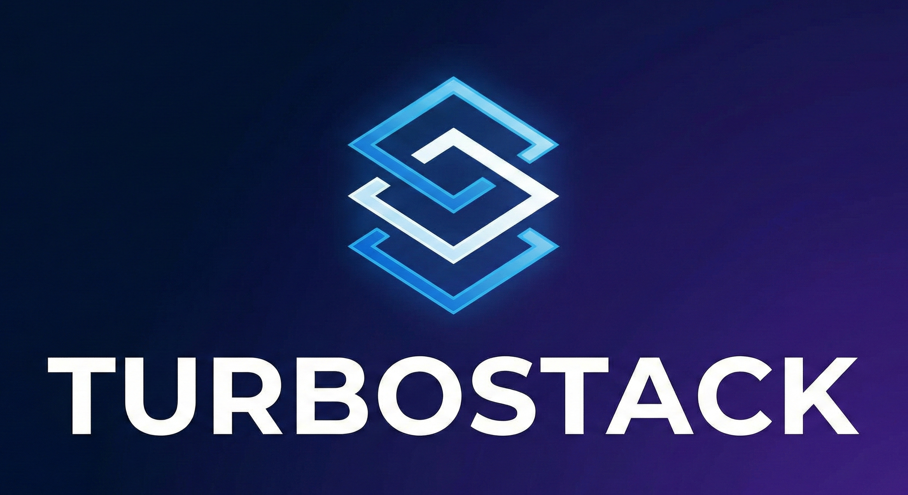

<div align="center">

<br/>


# Turbostack

<h4>

An immersive, full-stack TypeScript Turborepo monorepo. Built with [Next.js 16](https://nextjs.org/), [React 19](https://react.dev/), [Better Auth](https://www.better-auth.com/), [oRPC](https://orpc.unnoq.com/), and [Drizzle ORM](https://orm.drizzle.team/). Just run `bun dev` and keep building.

</h4>

<br/>

</div>

## ✨ Features

- **Monorepo Architecture** - Turborepo with Bun for fast, scalable development
- **Next.js 16** - App Router with React Server Components and React Compiler
- **Type-Safe API** - oRPC for end-to-end type safety between client and server
- **Authentication** - Better Auth with Drizzle adapter
- **Database** - Drizzle ORM with Neon serverless PostgreSQL
- **UI Components** - shadcn/ui with Radix UI primitives
- **Modern Tooling** - Biome for linting, TypeScript 5.9, Tailwind CSS 4.1
- **AI-Ready** - Powered by [Claude Code](https://claude.ai/code) with comprehensive CLAUDE.md, custom skills, hooks, and specialized agents for optimal AI-assisted development
- **Spec-Driven Ready** - Compatible with [OpenSpec](https://github.com/Fission-AI/OpenSpec), [Spec-Kit](https://github.com/github/spec-kit), and [spec-workflow-mcp](https://github.com/Pimzino/spec-workflow-mcp) for structured development workflows

## 🚀 Quick Start

**Just run one command:**

```bash
bun dev
```

That's it. `bun dev` automatically handles everything:

**First time:**
1. **Links/creates your Vercel project** (interactive - `bunx vercel link`)
2. **Guides you to install Neon** (PostgreSQL database via Vercel marketplace)
3. **Guides you to set up Resend** (email service via Vercel integration)
4. **Generates and configures Better Auth secrets** (automatic)
5. **Pulls environment variables from Vercel** (automatic)
6. **Runs first database migration** to set up the database schema (automatic)

**Every time:**
- Skips completed setup steps
- Runs `bun i` (installs/updates dependencies)
- Starts dev server with TypeScript watch mode (`tsw`) in parallel

Your development environment is always in sync. Just keep running `bun dev`.

**Note:** After making database schema changes, run `bun db:generate` to create migrations, then restart `bun dev` to apply them.

## 📦 Monorepo Structure

```
apps/
  web/              Next.js 16 application
packages/
  api/              Backend logic (auth, oRPC, database)
  email/            Email templates
  shared/           Shared utilities and configuration
  ui/               UI component library
  typescript-config/ Shared TypeScript configs
```

## 🛠️ Common Commands

```bash
bun dev           # Your main command - runs setup (first time) + dev server + TypeScript watch
bun ok            # Type check + lint (run this before commits!)
bun build         # Build all apps and packages

# Database commands
bun db:studio     # Open Drizzle Studio
bun db:generate   # Generate migrations (after schema changes)

# Additional commands
bun ts            # Type check all workspaces
bun lint          # Format and lint with Biome
bun knip          # Find unused files and dependencies
```

## 📚 Tech Stack

- **Framework**: Next.js 16, React 19.2
- **Language**: TypeScript 5.9
- **API**: oRPC with TanStack Query
- **Database**: Drizzle ORM + Neon
- **Auth**: Better Auth
- **UI**: shadcn/ui + Tailwind CSS 4.1
- **Tooling**: Turborepo, Bun, Biome
- **Email**: React Email + Resend

## 📖 Documentation

For detailed information about the project architecture, conventions, and workflows, see [CLAUDE.md](CLAUDE.md).

## 🤖 AI-Assisted Development

This project is optimized for [Claude Code](https://claude.ai/code), providing an exceptional AI-assisted development experience:

- **Comprehensive CLAUDE.md** - Extensive documentation covering architecture, patterns, conventions, and workflows
- **Custom Hooks** - Automated checks for code quality, type safety, and best practices
- **Specialized Agents** - Pre-configured agents for codebase exploration, planning, and implementation
- **MCP Servers** - Integrated Better Auth, Next.js DevTools, and Context7 for enhanced AI capabilities
- **Immersive Integration** - Everything from setup to development happens seamlessly within the workflow
- **Spec-Driven Ready** - Compatible with spec-driven development tools like [OpenSpec](https://github.com/Fission-AI/OpenSpec), [Spec-Kit](https://github.com/github/spec-kit), and [spec-workflow-mcp](https://github.com/Pimzino/spec-workflow-mcp)

The CLAUDE.md file ensures Claude Code has deep understanding of the codebase structure, coding standards, and development workflows, making AI pair programming seamless and productive.

## 🐳 Safe YOLO Mode (Devcontainer)

Use Claude Code's `--dangerously-skip-permissions` flag safely inside an isolated container:

1. Install the [Dev Containers](https://marketplace.visualstudio.com/items?itemName=ms-vscode-remote.remote-containers) extension in VS Code
2. Open project in VS Code → Click "Reopen in Container" when prompted
3. Run `claude --dangerously-skip-permissions`

The container provides network isolation (only essential domains allowed) and filesystem isolation (only the project directory is mounted). Your host system is protected.

**Customize network whitelist:** Edit `.devcontainer/init-firewall.sh`

[Learn more about devcontainers →](https://code.claude.com/docs/en/devcontainer)
