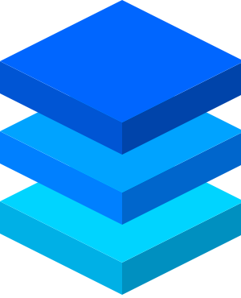

<div align="center">

<br/>


# Turbostack

<h4>

An immersive, full-stack TypeScript Turborepo monorepo. Built with [Next.js 16](https://nextjs.org/), [React 19](https://react.dev/), [Better Auth](https://www.better-auth.com/), [oRPC](https://orpc.unnoq.com/), and [Drizzle ORM](https://orm.drizzle.team/). Just run `bun dev` and keep building.

</h4>

<br/>

</div>

## ✨ Features

- **Monorepo Architecture** - Turborepo with Bun for fast, scalable development
- **Next.js 16** - App Router with React Server Components and React Compiler
- **Type-Safe API** - oRPC for end-to-end type safety between client and server
- **Authentication** - Better Auth with Drizzle adapter
- **Database** - [Drizzle ORM](https://orm.drizzle.team/) with [PGlite](https://pglite.dev/) for instant local dev (no setup), [Neon](https://neon.tech/) for production
- **UI Components** - shadcn/ui with Radix UI primitives
- **Modern Tooling** - Biome for linting, TypeScript 5.9, Tailwind CSS 4.1
- **Spec-Driven** - Compatible with [OpenSpec](https://github.com/Fission-AI/OpenSpec) for structured development workflows
- **AI-Ready** - Comprehensive CLAUDE.md for optimal AI-assisted development

## 🚀 Quick Start

**Just run one command:**

```bash
bun dev
```

That's it. `bun dev` automatically handles everything:

**First time:**
1. **Links/creates your Vercel project** (interactive - `bunx vercel link`)
2. **Guides you to install Neon** (PostgreSQL database via Vercel marketplace)
3. **Guides you to set up Resend** (email service via Vercel integration)
4. **Generates and configures Better Auth secrets** (automatic)
5. **Pulls environment variables from Vercel** (automatic)
6. **Runs first database migration** to set up the database schema (automatic)

**Every time:**
- Skips completed setup steps
- Runs `bun i` (installs/updates dependencies)
- Starts dev server with TypeScript watch mode (`tsw`) in parallel

Your development environment is always in sync. Just keep running `bun dev`.

**Note:** After making database schema changes, run `bun db:generate` to create migrations, then restart `bun dev` to apply them.

## 📦 Monorepo Structure

```
apps/
  web/              Next.js 16 application
packages/
  api/              Backend logic (auth, oRPC, database)
  email/            Email templates
  shared/           Shared utilities and configuration
  ui/               UI component library
  typescript-config/ Shared TypeScript configs
```

## 🛠️ Common Commands

```bash
bun dev           # Your main command - runs setup (first time) + dev server + TypeScript watch
bun ok            # Type check + lint + test (runs automatically on pre-commit via Husky)
bun build         # Build all apps and packages

# Database commands
bun db:studio     # Open Drizzle Studio
bun db:generate   # Generate migrations (after schema changes)

# Additional commands
bun ts            # Type check all workspaces
bun lint          # Format and lint with Biome
bun knip          # Find unused files and dependencies
```

## 📚 Tech Stack

- **Framework**: [Next.js 16](https://nextjs.org/), [React 19.2](https://react.dev/)
- **Language**: [TypeScript 5.9](https://www.typescriptlang.org/)
- **API**: [oRPC](https://orpc.unnoq.com/) with [TanStack Query](https://tanstack.com/query)
- **Database**: [Drizzle ORM](https://orm.drizzle.team/) + [PGlite](https://pglite.dev/) (local) / [Neon](https://neon.tech/) (prod)
- **Auth**: [Better Auth](https://www.better-auth.com/)
- **UI**: [shadcn/ui](https://ui.shadcn.com/) + [Tailwind CSS 4.1](https://tailwindcss.com/)
- **Tooling**: [Turborepo](https://turbo.build/), [Bun](https://bun.sh/), [Biome](https://biomejs.dev/)
- **Email**: [React Email](https://react.email/) + [Resend](https://resend.com/)

## 📖 Documentation

For detailed information about the project architecture, conventions, and workflows, see [CLAUDE.md](CLAUDE.md).

## 🤖 AI-Assisted Development

This project is optimized for [Claude Code](https://claude.ai/code):

- **Comprehensive CLAUDE.md** - Extensive documentation covering architecture, patterns, conventions, and workflows
- **Custom Slash Commands** - `/ok` for quick type checking and linting verification
- **MCP Servers** - Integrated Better Auth, Next.js DevTools, and Context7 for enhanced AI capabilities
- **OpenSpec** - Compatible with [OpenSpec](https://github.com/Fission-AI/OpenSpec) for structured development workflows
